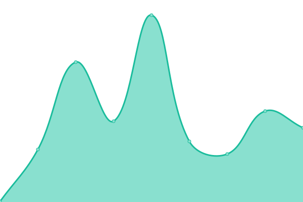

# [📈 Live Status](https://SJang1.github.io/ServerStatus): <!--live status--> **🟧 Partial outage**

This repository contains the open-source uptime monitor and status page for [SJang1](https://sjang.xyz), powered by [Upptime](https://github.com/upptime/upptime).

With [Upptime](https://upptime.js.org), you can get your own unlimited and free uptime monitor and status page, powered entirely by a GitHub repository. We use [Issues](https://github.com/SJang1/ServerStatus/issues) as incident reports, [Actions](https://github.com/SJang1/ServerStatus/actions) as uptime monitors, and [Pages](https://SJang1.github.io/ServerStatus) for the status page.

<!--start: status pages-->
<!-- This summary is generated by Upptime (https://github.com/upptime/upptime) -->
<!-- Do not edit this manually, your changes will be overwritten -->
<!-- prettier-ignore -->
| URL | Status | History | Response Time | Uptime |
| --- | ------ | ------- | ------------- | ------ |
|  Desktop_Outline_API | 🟩 Up | [desktop-outline-api.yml](https://github.com/SJang1/ServerStatus/commits/HEAD/history/desktop-outline-api.yml) | 

 832ms
     
 | 

<a href="https://SJang1.github.io/ServerStatus/history/desktop-outline-api">100.00%</a>
    

|  [CloudflareAccess @ SJang](https://sjang.cloudflareaccess.com/#/NoAuth) | 🟩 Up | [cloudflare-access-s-jang.yml](https://github.com/SJang1/ServerStatus/commits/HEAD/history/cloudflare-access-s-jang.yml) | 

 203ms
     
 | 

<a href="https://SJang1.github.io/ServerStatus/history/cloudflare-access-s-jang">100.00%</a>
    

|  [sjang.xyz](https://sjang.xyz/) | 🟥 Down | [sjang-xyz.yml](https://github.com/SJang1/ServerStatus/commits/HEAD/history/sjang-xyz.yml) | 

 0ms
     
 | 

<a href="https://SJang1.github.io/ServerStatus/history/sjang-xyz">0.00%</a>
    

|  [sjang.xyz - ping](https://sjang.xyz/ping) | 🟥 Down | [sjang-xyz-ping.yml](https://github.com/SJang1/ServerStatus/commits/HEAD/history/sjang-xyz-ping.yml) | 

 0ms
     
 | 

<a href="https://SJang1.github.io/ServerStatus/history/sjang-xyz-ping">0.00%</a>
    

|  [dl-server-1@sjang.xyz](http://dl.sjang.xyz/) | 🟥 Down | [dl-server-1-sjang-xyz.yml](https://github.com/SJang1/ServerStatus/commits/HEAD/history/dl-server-1-sjang-xyz.yml) | 

 0ms
     
 | 

<a href="https://SJang1.github.io/ServerStatus/history/dl-server-1-sjang-xyz">0.00%</a>
    

|  [dl-server-2@sjang.xyz](http://dl2.sjang.xyz/) | 🟩 Up | [dl-server-2-sjang-xyz.yml](https://github.com/SJang1/ServerStatus/commits/HEAD/history/dl-server-2-sjang-xyz.yml) | 

 493ms
     
 | 

<a href="https://SJang1.github.io/ServerStatus/history/dl-server-2-sjang-xyz">0.00%</a>
    

|  [dl-server-3@sjang.xyz](http://dl3.sjang.xyz/) | 🟥 Down | [dl-server-3-sjang-xyz.yml](https://github.com/SJang1/ServerStatus/commits/HEAD/history/dl-server-3-sjang-xyz.yml) | 

 0ms
     
 | 

<a href="https://SJang1.github.io/ServerStatus/history/dl-server-3-sjang-xyz">0.00%</a>
    

|  [desktop.sjang.dev - ping](https://desktop.sjang.dev/ping) | 🟩 Up | [desktop-sjang-dev-ping.yml](https://github.com/SJang1/ServerStatus/commits/HEAD/history/desktop-sjang-dev-ping.yml) | 

 611ms
     
 | 

<a href="https://SJang1.github.io/ServerStatus/history/desktop-sjang-dev-ping">100.00%</a>
    

|  [upload.sjang.xyz - ping](https://upload.sjang.xyz/ping) | 🟩 Up | [upload-sjang-xyz-ping.yml](https://github.com/SJang1/ServerStatus/commits/HEAD/history/upload-sjang-xyz-ping.yml) | 

 636ms
     
 | 

<a href="https://SJang1.github.io/ServerStatus/history/upload-sjang-xyz-ping">100.00%</a>
    

<!--end: status pages-->

[**Visit our status website →**](https://SJang1.github.io/ServerStatus)

## 📄 License

- Code: [MIT](./LICENSE) © [SJang1](https://sjang.xyz)
- Data in the `./history` directory: [Open Database License](https://opendatacommons.org/licenses/odbl/1-0/)
