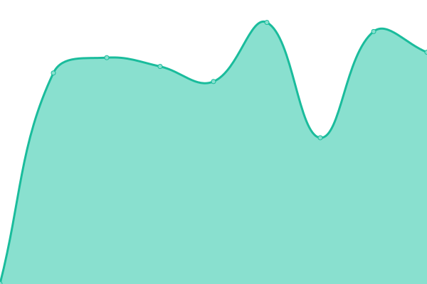
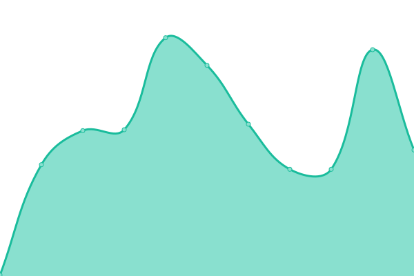
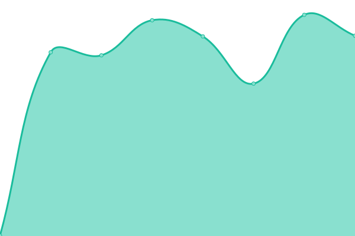

# [📈 Live Status](https://SJang1.github.io/ServerStatus): <!--live status--> **🟧 Partial outage**

This repository contains the open-source uptime monitor and status page for [SJang1](https://sjang.xyz), powered by [Upptime](https://github.com/upptime/upptime).

With [Upptime](https://upptime.js.org), you can get your own unlimited and free uptime monitor and status page, powered entirely by a GitHub repository. We use [Issues](https://github.com/SJang1/ServerStatus/issues) as incident reports, [Actions](https://github.com/SJang1/ServerStatus/actions) as uptime monitors, and [Pages](https://SJang1.github.io/ServerStatus) for the status page.

<!--start: status pages-->
<!-- This summary is generated by Upptime (https://github.com/upptime/upptime) -->
<!-- Do not edit this manually, your changes will be overwritten -->

| URL                                                                     | Status  | History                                                                                                                    | Response Time                                                                                 | Uptime                                                                                                                                                                                                                                                    |
| ----------------------------------------------------------------------- | ------- | -------------------------------------------------------------------------------------------------------------------------- | --------------------------------------------------------------------------------------------- | --------------------------------------------------------------------------------------------------------------------------------------------------------------------------------------------------------------------------------------------------------- |
| Desktop_Outline_API                                                     | 🟩 Up   | [desktop-outline-api.yml](https://github.com/SJang1/ServerStatus/commits/master/history/desktop-outline-api.yml)           |  775ms      |            |
| [CloudflareAccess @ SJang](https://sjang.cloudflareaccess.com/#/NoAuth) | 🟩 Up   | [cloudflare-access-s-jang.yml](https://github.com/SJang1/ServerStatus/commits/master/history/cloudflare-access-s-jang.yml) |  165ms |  |
| [sjang.xyz](https://sjang.xyz/)                                         | 🟥 Down | [sjang-xyz.yml](https://github.com/SJang1/ServerStatus/commits/master/history/sjang-xyz.yml)                               |  0ms                  |                                  |
| [sjang.xyz - ping](https://sjang.xyz/ping)                              | 🟥 Down | [sjang-xyz-ping.yml](https://github.com/SJang1/ServerStatus/commits/master/history/sjang-xyz-ping.yml)                     |  0ms             |                        |
| [dl-server-1@sjang.xyz](http://dl.sjang.xyz/)                           | 🟥 Down | [dl-server-1-sjang-xyz.yml](https://github.com/SJang1/ServerStatus/commits/master/history/dl-server-1-sjang-xyz.yml)       |  0ms      |          |
| [dl-server-2@sjang.xyz](http://dl2.sjang.xyz/)                          | 🟥 Down | [dl-server-2-sjang-xyz.yml](https://github.com/SJang1/ServerStatus/commits/master/history/dl-server-2-sjang-xyz.yml)       |  254ms    |          |
| [dl-server-3@sjang.xyz](http://dl3.sjang.xyz/)                          | 🟥 Down | [dl-server-3-sjang-xyz.yml](https://github.com/SJang1/ServerStatus/commits/master/history/dl-server-3-sjang-xyz.yml)       |  0ms      |          |
| [desktop.sjang.dev - ping](https://desktop.sjang.dev/ping)              | 🟩 Up   | [desktop-sjang-dev-ping.yml](https://github.com/SJang1/ServerStatus/commits/master/history/desktop-sjang-dev-ping.yml)     |  524ms   |      |
| [upload.sjang.xyz - ping](https://upload.sjang.xyz/ping)                | 🟩 Up   | [upload-sjang-xyz-ping.yml](https://github.com/SJang1/ServerStatus/commits/master/history/upload-sjang-xyz-ping.yml)       |  572ms    |        |

<!--end: status pages-->

[**Visit our status website →**](https://SJang1.github.io/ServerStatus)

## 📄 License

- Code: [MIT](./LICENSE) © [SJang1](https://sjang.xyz)
- Data in the `./history` directory: [Open Database License](https://opendatacommons.org/licenses/odbl/1-0/)
